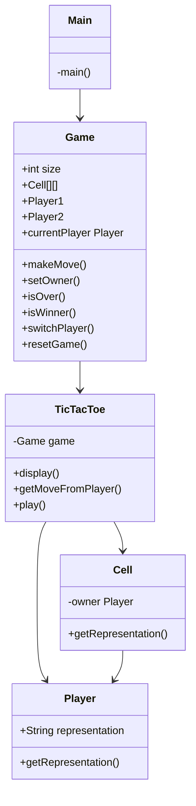
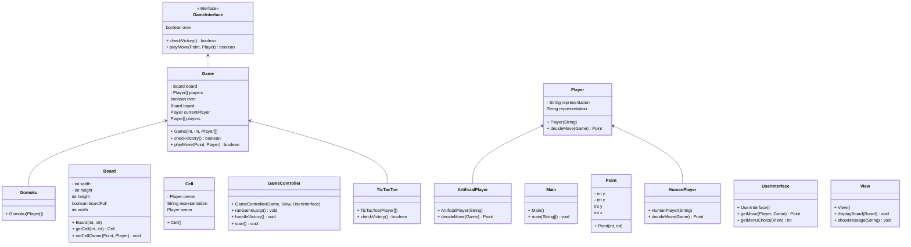
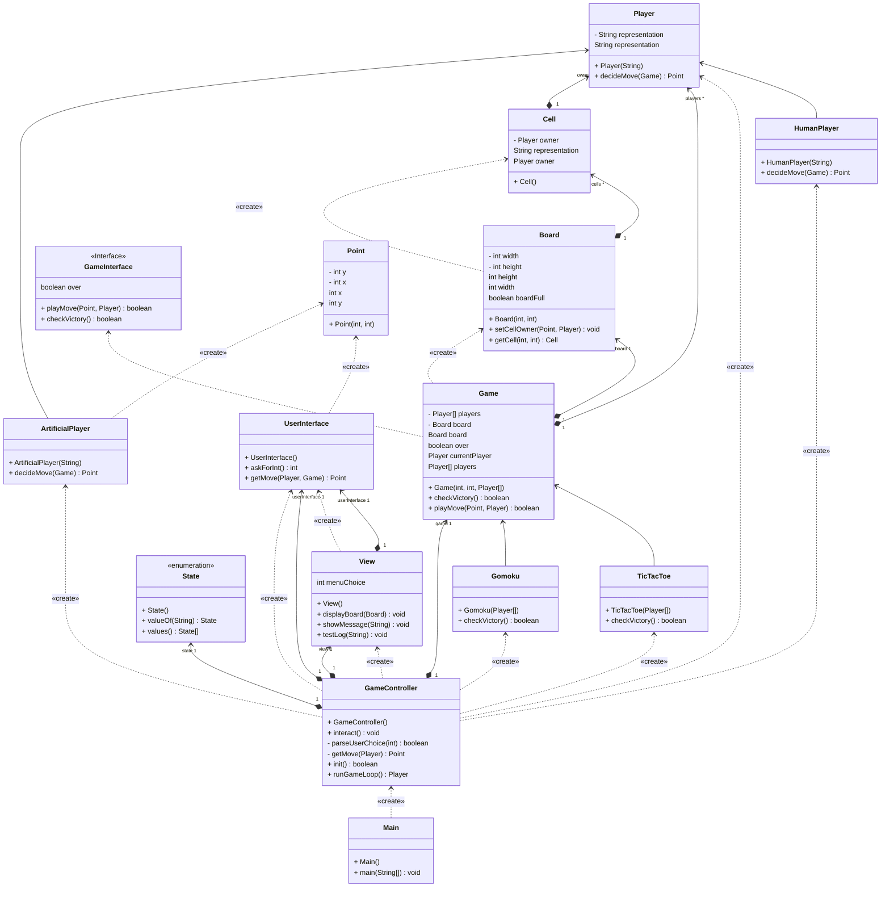

TicTacToe – Version 1.0

Description

TicTacToe is a two-player game played on a 3x3 grid. Players take turns placing their symbol (X or O) on the grid. 
The goal is to align three symbols horizontally, vertically, or diagonally before the opponent. 
If all cells are filled without a winner, the game ends in a draw.

This project is developed as part of the Advanced Developer training and aims to practice object-oriented design and Java programming.

Development Roadmap / Iterations

The game development will be carried out in several iterations, each adding new functionality:

Iteration 0 – Preparatory Reflections
  - Plan the overall design and structure of the game.
  - Define main classes, responsibilities, and relationships.

Class diagram (v1)
Here is the diagram representing the main classes in this first version:

Iteration 1 – Display the Game Board
  - Implement the Board class.
  - Display an empty 3x3 grid in the console.

Iteration 2 – Player Creation and Cell Capture
  - Add a Player class and link each Cell to its owner.
  - Implement the logic to ask the player for their move.

Iteration 3 – Multiplayer TicTacToe
  - Add a second player to the game.
  - Allow players to take turns until the board is full.

Iteration 4 – Game End Conditions
  - Stop the game when a player aligns three symbols.
  - Detect a draw if the board is fully occupied without a winner.

Class Diagramm type MVC (v2)

Class Diagram type MVC (v3)

