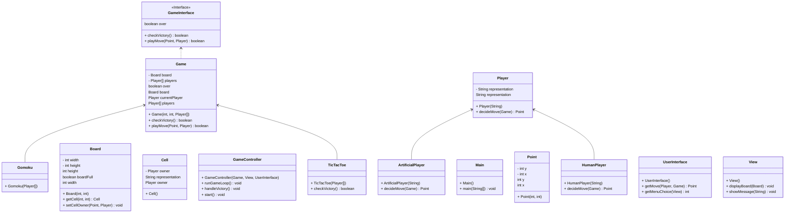

```mermaid
classDiagram
direction BT
class ArtificialPlayer {
+ ArtificialPlayer(String)
+ decideMove(Game) Point
  }
  class Board {
+ Board(int, int)
- int width
- int height
+ getCell(int, int) Cell
+ setCellOwner(Point, Player) void
  int height
  boolean boardFull
  int width
  }
  class Cell {
+ Cell()
- Player owner
  String representation
  Player owner
  }
  class Game {
+ Game(int, int, Player[])
- Board board
- Player[] players
+ checkVictory() boolean
+ playMove(Point, Player) boolean
  boolean over
  Board board
  Player currentPlayer
  Player[] players
  }
  class GameController {
+ GameController(Game, View, UserInterface)
+ runGameLoop() void
+ handleVictory() void
+ start() void
  }
  class GameInterface {
  <<Interface>>
+ checkVictory() boolean
+ playMove(Point, Player) boolean
  boolean over
  }
  class Gomoku {
+ Gomoku(Player[])
  }
  class HumanPlayer {
+ HumanPlayer(String)
+ decideMove(Game) Point
  }
  class Main {
+ Main()
+ main(String[]) void
  }
  class Player {
+ Player(String)
- String representation
+ decideMove(Game) Point
  String representation
  }
  class Point {
+ Point(int, int)
- int y
- int x
  int y
  int x
  }
  class TicTacToe {
+ TicTacToe(Player[])
+ checkVictory() boolean
  }
  class UserInterface {
+ UserInterface()
+ getMove(Player, Game) Point
+ getMenuChoice(View) int
  }
  class View {
+ View()
+ displayBoard(Board) void
+ showMessage(String) void
  }

ArtificialPlayer  -->  Player
Game  ..>  GameInterface
Gomoku  -->  Game
HumanPlayer  -->  Player
TicTacToe  -->  Game 
```